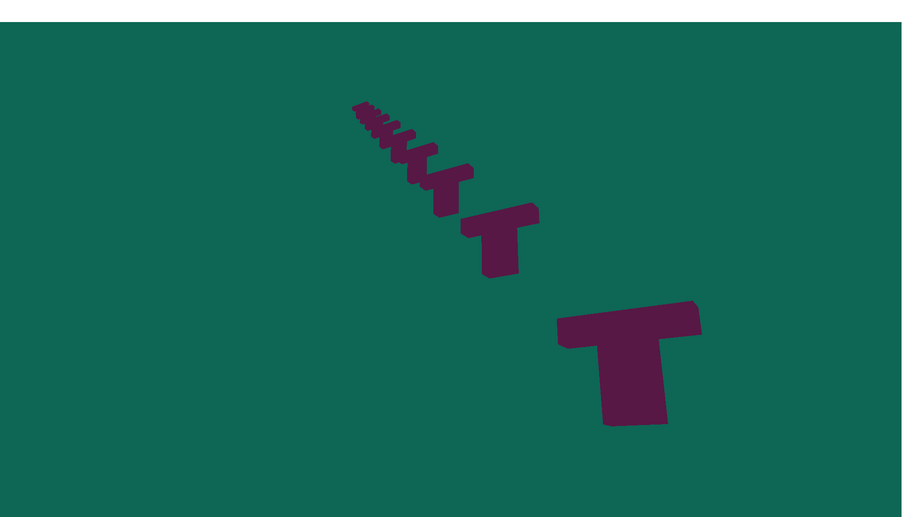

# P# Programación Gráfica - SA (FICCT)

En este repositorio se encuentran todos los proyectos y tareas asignados por el Ing. Peinado en el curso de Programación Gráfica. A continuación, se describen los proyectos actuales incluidos en el repositorio:

## Proyectos Incluidos

### [Tarea #1: Creación de la clase "Game" y modelado 3D de una figura "T"](OpenTK_Tarea#1/)

- **Descripción:** En esta primera tarea, se implementó la base de un entorno 3D usando OpenTK, con la clase `Game` como eje principal. Esta clase gestiona la creación de una ventana gráfica, la configuración de OpenGL, el renderizado del modelo 3D de una figura en forma de "T", y la manipulación de la cámara.

  - **Clases Principales:**
    - **`Game`:** La clase principal que hereda de `GameWindow` de OpenTK. Se encarga de gestionar la ventana, el ciclo de renderizado y los eventos de entrada del usuario. 
      - **Vértices y Colores:** Define los vértices y colores de la figura en forma de "T", tanto para las caras frontales como traseras, así como los índices para conectar estos vértices en triángulos.
      - **Buffer Objects:** Configura los VBOs (Vertex Buffer Objects), EBOs (Element Buffer Objects) y VAOs (Vertex Array Objects) para almacenar los datos de la geometría en la GPU.
      - **Shaders:** Define y compila los shaders de vértices y fragmentos necesarios para renderizar la figura. Aplica las transformaciones de modelado, vista y proyección para mostrar la figura en 3D.
      - **Eventos de Entrada:** Maneja los eventos de entrada del usuario, delegando el control de la cámara a la clase `Inputs`.

    - **`camera`:** Gestiona la posición, orientación y movimiento de la cámara en la escena 3D. Implementa funciones para mover la cámara en todas las direcciones (adelante, atrás, izquierda, derecha, arriba, abajo) y para rotar la vista con el mouse.
      - **Movimiento de la Cámara:** Permite mover la cámara a lo largo de los ejes X, Y y Z utilizando el teclado.
      - **Rotación de la Cámara:** Controla la rotación de la cámara con el movimiento del mouse, permitiendo una vista dinámica del modelo 3D.
      - **View Matrix:** Genera la matriz de vista, que es usada por OpenGL para posicionar la cámara en la escena.

    - **`Inputs`:** Procesa la entrada del usuario y permite la interacción con la cámara y otros elementos del entorno. Se encarga de detectar las teclas presionadas y mover la cámara en consecuencia.
      - **Captura de Pantalla:** Añade la funcionalidad para capturar una imagen de la ventana actual presionando una tecla específica.

    - **`Screenshot`:** Proporciona la funcionalidad para capturar la pantalla y guardar la imagen en un archivo PNG. Utiliza la biblioteca ImageSharp para manejar la manipulación de imágenes.
      - **Guardar Captura:** Captura la imagen de la ventana de OpenGL y la guarda en una carpeta predefinida en el sistema, facilitando la documentación visual del trabajo.

- **Captura de Pantalla:**
  

### [Tarea #2: Refactorización de la clase "Game" y encapsulación en la clase "Objeto"](OpenTK_Tarea#2/)

- **Descripción:** En esta segunda tarea, se llevó a cabo una refactorización significativa del código desarrollado en la Tarea #1, con el objetivo de mejorar la modularización y la mantenibilidad. Se introdujeron nuevas clases para separar las responsabilidades y simplificar la gestión del proyecto.

  - **Clases Principales:**
    - **`Game`:** La clase principal sigue siendo `Game`, que hereda de `GameWindow` de OpenTK. Sin embargo, se ha simplificado para delegar gran parte de la lógica de renderizado y manipulación de objetos a nuevas clases especializadas.
      - **Delegación de Responsabilidades:** Ahora, `Game` delega la gestión del modelo 3D a la clase `Objeto` y la responsabilidad del proceso de renderizado a la clase `Renderización`.
      - **Configuración de Buffers:** Durante la carga (`OnLoad`), la clase `Renderización` se encarga de configurar los buffers necesarios para almacenar los datos de vértices, colores e índices, liberando a `Game` de esta tarea.
      - **Renderizado:** El método `OnRenderFrame` de `Game` ahora simplemente invoca a `Renderización` para manejar el renderizado del objeto, aplicando las matrices de modelo, vista y proyección.

    - **`Objeto`:** Una nueva clase introducida para encapsular la geometría y las propiedades transformacionales del modelo en forma de "T".
      - **Posición, Rotación y Escala:** Esta clase maneja las transformaciones básicas del objeto, como su posición, rotación y escala en el espacio 3D.
      - **Configuración de Vértices y Colores:** `Objeto` inicializa los vértices y colores del modelo, utilizando configuraciones relativas para facilitar su manipulación.
      - **Índices de Triángulos:** Define cómo se conectan los vértices mediante índices, lo que permite formar las caras del modelo "T".

    - **`Renderización`:** Esta clase se encarga de la configuración y gestión de los buffers y del proceso de renderizado.
      - **Buffers (VBOs, EBOs, VAOs):** Se encarga de generar y configurar los buffers de vértices, colores e índices, asegurando que los datos se carguen correctamente en la GPU.
      - **Shaders:** Aplica los shaders y gestiona el ciclo de renderizado para que el objeto se dibuje en la ventana con las transformaciones adecuadas.
      - **Transformaciones:** Calcula la matriz de modelo para transformar el objeto según su posición, rotación y escala antes de renderizarlo.

  - **Mejoras Clave:**
    - **Modularización:** Al separar la lógica del objeto y el renderizado en sus propias clases (`Objeto` y `Renderización`), el código es ahora más modular y fácil de mantener.
    - **Facilidad de Expansión:** Esta estructura facilita la expansión del proyecto, permitiendo agregar nuevos objetos y diferentes métodos de renderizado sin afectar la clase principal `Game`.

- **Captura de Pantalla:**
  
### [Tarea #3: Modularización completa y simplificación de la clase "Game"](OpenTK_Tarea#3/)

- **Descripción:** En esta tercera tarea, se implementó una modularización completa del proyecto, simplificando la clase `Game` y distribuyendo las responsabilidades entre varias clases especializadas. El objetivo fue mejorar la estructura del código, facilitando su mantenibilidad y ampliación.

  - **Clases Principales:**
    - **`Game`:** La clase principal que maneja la ventana del juego y el ciclo de renderizado.
      - **Escenario:** Ahora, `Game` delega la creación y gestión de objetos 3D a la clase `Escenario`. Este escenario es responsable de manejar múltiples instancias de objetos en la escena.
      - **Renderización:** `Game` delega el proceso de renderizado a la clase `Renderización`, que se encarga de manejar los buffers y shaders necesarios para dibujar los objetos en la escena.
      - **Shader Management:** Los shaders se gestionan a través de la clase `Shader`, que carga, compila y enlaza los shaders necesarios para renderizar los objetos.

    - **`Escenario`:** Una nueva clase que administra todos los objetos presentes en la escena.
      - **Gestión de Objetos:** Esta clase permite agregar objetos al escenario y se encarga de dibujar todos los objetos utilizando la clase `Renderización`.
      - **Dibujo del Escenario:** Durante el ciclo de renderizado, `Escenario` itera a través de todos los objetos y les indica que se dibujen utilizando las transformaciones aplicadas.

    - **`Objeto`:** Encapsula la geometría y las propiedades transformacionales de los objetos 3D.
      - **Partes y Polígonos:** Un objeto puede estar compuesto por múltiples partes (`Parte`), y cada parte puede contener múltiples polígonos (`Poligono`). Esto permite construir objetos complejos a partir de componentes más simples.
      - **Transformaciones:** La clase `Objeto` maneja las transformaciones básicas del objeto, como la posición, rotación y escala, y calcula la matriz de modelo para aplicar estas transformaciones durante el renderizado.

    - **`Parte`:** Representa una parte individual de un objeto, que puede estar compuesta por múltiples polígonos.
      - **Agregar Polígonos:** Cada `Parte` puede agregar y gestionar múltiples instancias de `Poligono`, permitiendo una mayor flexibilidad en la definición de la geometría del objeto.

    - **`Poligono`:** Define la geometría de un polígono en 3D, incluyendo los vértices, colores e índices que determinan cómo se dibuja en la pantalla.
      - **Vertices, Colores, Índices:** Cada `Poligono` encapsula la información necesaria para definir una superficie 3D, lo que permite construir objetos 3D detallados.

    - **`Renderización`:** Se encarga de la configuración y gestión de los buffers y del proceso de renderizado.
      - **Buffers (VBOs, EBOs, VAOs):** Configura y gestiona los buffers necesarios para cargar los datos de los vértices, colores e índices en la GPU.
      - **Shaders:** Gestiona la aplicación de shaders durante el proceso de renderizado, enviando las matrices de transformación necesarias para dibujar los objetos en la escena.

    - **`Shader`:** Gestiona la carga, compilación y uso de los shaders necesarios para el renderizado de la escena.
      - **Compilación y Enlace de Shaders:** Carga los shaders desde archivos de texto, los compila y los enlaza en un programa de shaders que se usa durante el ciclo de renderizado.
      - **Envío de Matrices Uniformes:** Envía las matrices de transformación (modelo, vista, proyección) a los shaders para aplicarlas durante el proceso de renderizado.

  - **Mejoras Clave:**
    - **Modularización Extrema:** Cada componente del renderizado y manejo de objetos 3D ha sido modularizado, lo que permite una mayor flexibilidad y facilidad de mantenimiento.
    - **Capacidad de Escalabilidad:** La estructura del código ahora permite agregar nuevos objetos y partes sin modificar la clase `Game`, facilitando la expansión del proyecto con nuevas características y funcionalidades.

- **Captura de Pantalla:**
  
