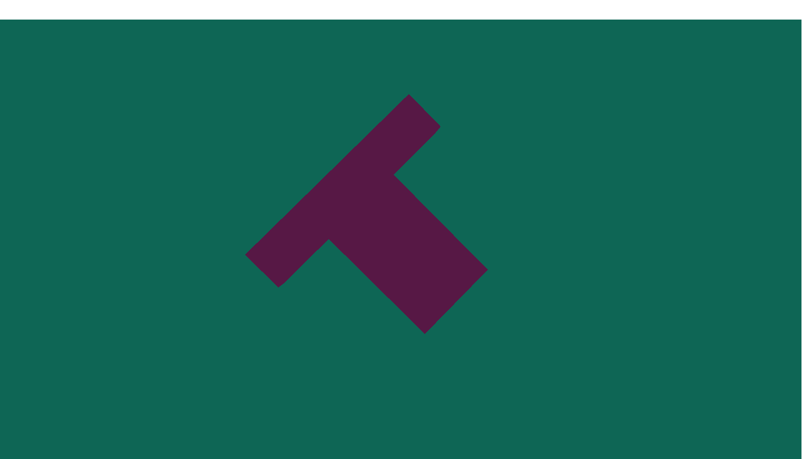

# [Programación Gráfica - SA (FICCT)](Programacion_Grafica_SA_-2-2024-)

En este repositorio se encuentran todos los proyectos y tareas asignados por el Ing. Peinado en el curso de Programación Gráfica. A continuación, se describen los proyectos actuales incluidos en el repositorio:

## Proyectos Incluidos

## [Tarea #1: Creación de la clase "Game" y modelado 3D de una figura "T"](OpenTK_Tarea#1/)

- **Descripción:** En esta primera tarea, se implementó la base de un entorno 3D usando OpenTK, con la clase `Game` como eje principal. Esta clase gestiona la creación de una ventana gráfica, la configuración de OpenGL, el renderizado del modelo 3D de una figura en forma de "T", y la manipulación de la cámara.

  - **Clases Principales:**
    - **`Game`:** La clase principal que hereda de `GameWindow` de OpenTK. Se encarga de gestionar la ventana, el ciclo de renderizado y los eventos de entrada del usuario. 
      - **Vértices y Colores:** Define los vértices y colores de la figura en forma de "T", tanto para las caras frontales como traseras, así como los índices para conectar estos vértices en triángulos.
      - **Buffer Objects:** Configura los VBOs (Vertex Buffer Objects), EBOs (Element Buffer Objects) y VAOs (Vertex Array Objects) para almacenar los datos de la geometría en la GPU.
      - **Shaders:** Define y compila los shaders de vértices y fragmentos necesarios para renderizar la figura. Aplica las transformaciones de modelado, vista y proyección para mostrar la figura en 3D.
      - **Eventos de Entrada:** Maneja los eventos de entrada del usuario, delegando el control de la cámara a la clase `Inputs`.

    - **`camera`:** Gestiona la posición, orientación y movimiento de la cámara en la escena 3D. Implementa funciones para mover la cámara en todas las direcciones (adelante, atrás, izquierda, derecha, arriba, abajo) y para rotar la vista con el mouse.
      - **Movimiento de la Cámara:** Permite mover la cámara a lo largo de los ejes X, Y y Z utilizando el teclado.
      - **Rotación de la Cámara:** Controla la rotación de la cámara con el movimiento del mouse, permitiendo una vista dinámica del modelo 3D.
      - **View Matrix:** Genera la matriz de vista, que es usada por OpenGL para posicionar la cámara en la escena.

    - **`Inputs`:** Procesa la entrada del usuario y permite la interacción con la cámara y otros elementos del entorno. Se encarga de detectar las teclas presionadas y mover la cámara en consecuencia.
      - **Captura de Pantalla:** Añade la funcionalidad para capturar una imagen de la ventana actual presionando una tecla específica.

    - **`Screenshot`:** Proporciona la funcionalidad para capturar la pantalla y guardar la imagen en un archivo PNG. Utiliza la biblioteca ImageSharp para manejar la manipulación de imágenes.
      - **Guardar Captura:** Captura la imagen de la ventana de OpenGL y la guarda en una carpeta predefinida en el sistema, facilitando la documentación visual del trabajo.

- **Captura de Pantalla:**
  

## [Tarea #2: Refactorización de la clase "Game" y encapsulación en la clase "Objeto"](OpenTK_Tarea#2/)

- **Descripción:** En esta segunda tarea, se llevó a cabo una refactorización significativa del código desarrollado en la Tarea #1, con el objetivo de mejorar la modularización y la mantenibilidad. Se introdujeron nuevas clases para separar las responsabilidades y simplificar la gestión del proyecto.

  - **Clases Principales:**
    - **`Game`:** La clase principal sigue siendo `Game`, que hereda de `GameWindow` de OpenTK. Sin embargo, se ha simplificado para delegar gran parte de la lógica de renderizado y manipulación de objetos a nuevas clases especializadas.
      - **Delegación de Responsabilidades:** Ahora, `Game` delega la gestión del modelo 3D a la clase `Objeto` y la responsabilidad del proceso de renderizado a la clase `Renderización`.
      - **Configuración de Buffers:** Durante la carga (`OnLoad`), la clase `Renderización` se encarga de configurar los buffers necesarios para almacenar los datos de vértices, colores e índices, liberando a `Game` de esta tarea.
      - **Renderizado:** El método `OnRenderFrame` de `Game` ahora simplemente invoca a `Renderización` para manejar el renderizado del objeto, aplicando las matrices de modelo, vista y proyección.

    - **`Objeto`:** Una nueva clase introducida para encapsular la geometría y las propiedades transformacionales del modelo en forma de "T".
      - **Posición, Rotación y Escala:** Esta clase maneja las transformaciones básicas del objeto, como su posición, rotación y escala en el espacio 3D.
      - **Configuración de Vértices y Colores:** `Objeto` inicializa los vértices y colores del modelo, utilizando configuraciones relativas para facilitar su manipulación.
      - **Índices de Triángulos:** Define cómo se conectan los vértices mediante índices, lo que permite formar las caras del modelo "T".

    - **`Renderización`:** Esta clase se encarga de la configuración y gestión de los buffers y del proceso de renderizado.
      - **Buffers (VBOs, EBOs, VAOs):** Se encarga de generar y configurar los buffers de vértices, colores e índices, asegurando que los datos se carguen correctamente en la GPU.
      - **Shaders:** Aplica los shaders y gestiona el ciclo de renderizado para que el objeto se dibuje en la ventana con las transformaciones adecuadas.
      - **Transformaciones:** Calcula la matriz de modelo para transformar el objeto según su posición, rotación y escala antes de renderizarlo.

  - **Mejoras Clave:**
    - **Modularización:** Al separar la lógica del objeto y el renderizado en sus propias clases (`Objeto` y `Renderización`), el código es ahora más modular y fácil de mantener.
    - **Facilidad de Expansión:** Esta estructura facilita la expansión del proyecto, permitiendo agregar nuevos objetos y diferentes métodos de renderizado sin afectar la clase principal `Game`.

- **Captura de Pantalla:**
  
## [Tarea #3: Modularización completa y simplificación de la clase "Game"](OpenTK_Tarea#3/)

- **Descripción:** En esta tercera tarea, se implementó una modularización completa del proyecto, simplificando la clase `Game` y distribuyendo las responsabilidades entre varias clases especializadas. El objetivo fue mejorar la estructura del código, facilitando su mantenibilidad y ampliación.

  - **Clases Principales:**
    - **`Game`:** La clase principal que maneja la ventana del juego y el ciclo de renderizado.
      - **Escenario:** Ahora, `Game` delega la creación y gestión de objetos 3D a la clase `Escenario`. Este escenario es responsable de manejar múltiples instancias de objetos en la escena.
      - **Renderización:** `Game` delega el proceso de renderizado a la clase `Renderización`, que se encarga de manejar los buffers y shaders necesarios para dibujar los objetos en la escena.
      - **Shader Management:** Los shaders se gestionan a través de la clase `Shader`, que carga, compila y enlaza los shaders necesarios para renderizar los objetos.

    - **`Escenario`:** Una nueva clase que administra todos los objetos presentes en la escena.
      - **Gestión de Objetos:** Esta clase permite agregar objetos al escenario y se encarga de dibujar todos los objetos utilizando la clase `Renderización`.
      - **Dibujo del Escenario:** Durante el ciclo de renderizado, `Escenario` itera a través de todos los objetos y les indica que se dibujen utilizando las transformaciones aplicadas.

    - **`Objeto`:** Encapsula la geometría y las propiedades transformacionales de los objetos 3D.
      - **Partes y Polígonos:** Un objeto puede estar compuesto por múltiples partes (`Parte`), y cada parte puede contener múltiples polígonos (`Poligono`). Esto permite construir objetos complejos a partir de componentes más simples.
      - **Transformaciones:** La clase `Objeto` maneja las transformaciones básicas del objeto, como la posición, rotación y escala, y calcula la matriz de modelo para aplicar estas transformaciones durante el renderizado.

    - **`Parte`:** Representa una parte individual de un objeto, que puede estar compuesta por múltiples polígonos.
      - **Agregar Polígonos:** Cada `Parte` puede agregar y gestionar múltiples instancias de `Poligono`, permitiendo una mayor flexibilidad en la definición de la geometría del objeto.

    - **`Poligono`:** Define la geometría de un polígono en 3D, incluyendo los vértices, colores e índices que determinan cómo se dibuja en la pantalla.
      - **Vertices, Colores, Índices:** Cada `Poligono` encapsula la información necesaria para definir una superficie 3D, lo que permite construir objetos 3D detallados.

    - **`Renderización`:** Se encarga de la configuración y gestión de los buffers y del proceso de renderizado.
      - **Buffers (VBOs, EBOs, VAOs):** Configura y gestiona los buffers necesarios para cargar los datos de los vértices, colores e índices en la GPU.
      - **Shaders:** Gestiona la aplicación de shaders durante el proceso de renderizado, enviando las matrices de transformación necesarias para dibujar los objetos en la escena.

    - **`Shader`:** Gestiona la carga, compilación y uso de los shaders necesarios para el renderizado de la escena.
      - **Compilación y Enlace de Shaders:** Carga los shaders desde archivos de texto, los compila y los enlaza en un programa de shaders que se usa durante el ciclo de renderizado.
      - **Envío de Matrices Uniformes:** Envía las matrices de transformación (modelo, vista, proyección) a los shaders para aplicarlas durante el proceso de renderizado.

  - **Mejoras Clave:**
    - **Modularización Extrema:** Cada componente del renderizado y manejo de objetos 3D ha sido modularizado, lo que permite una mayor flexibilidad y facilidad de mantenimiento.
    - **Capacidad de Escalabilidad:** La estructura del código ahora permite agregar nuevos objetos y partes sin modificar la clase `Game`, facilitando la expansión del proyecto con nuevas características y funcionalidades.

- **Captura de Pantalla:**
  

## Tarea #4: Serialización del Modelo 3D y Mejoras Adicionales

- ## Descripción General

  - La **Tarea #4** tiene como meta principal la **serialización de modelos 3D** desde la memoria, guardándolos en un archivo en formato **JSON**. Adicionalmente, se implementaron mejoras al proyecto como interpolaciones para animaciones y refactorización de código, optimizando así su modularidad, facilidad de uso y eficiencia.

- ## Objetivo Principal: Serialización del Modelo 3D

  - El objetivo principal es poder **serializar modelos 3D** que se encuentran en la memoria y guardarlos en archivos **JSON**. Esto facilita que puedas guardar el estado de los objetos 3D en la escena y cargarlos más tarde, haciendo posible reutilizarlos o modificarlos.

- ## Conceptos Importantes

  ### 1. ¿Qué es la serialización?

    - **Serialización** es el proceso de convertir un objeto (en este caso, un modelo 3D) a un formato que pueda almacenarse o transferirse. El formato elegido aquí es **JSON**.

    - **JSON** (JavaScript Object Notation) es un formato de texto simple y legible, ideal para representar datos estructurados como objetos.

    - En este proyecto, serializar un modelo 3D significa tomar los **atributos y geometría** de un objeto y convertirlos en una representación que se pueda guardar en un archivo de texto.

  ### 2. ¿Qué es un DTO?

    - **DTO** significa "Data Transfer Object", o en español, "Objeto de Transferencia de Datos". Un DTO actúa como una versión simplificada de un objeto complejo, en este caso, de un objeto 3D.

  - Los **DTOs** son ideales para serialización porque convierten estructuras complicadas en representaciones más simples y compactas.

- ## Componentes Clave para la Serialización

  - ### Clase `Serializador`

    - Esta clase maneja todo lo relacionado con la **serialización** y **deserialización** de los modelos 3D. Dentro de la clase `Serializador`, tenemos varios métodos que gestionan guardar, cargar y manejar los modelos.

  - ### Métodos importantes en la clase `Serializador`

    - **`Guardar3D(string idModelo, Escenario escenario)`**:  
      - Toma un modelo 3D desde la memoria y lo convierte a un archivo **JSON**.
      - Requiere el **ID del modelo** (un nombre único que identifica al modelo 3D) y el **escenario** (donde están almacenados los objetos 3D).
      - Convierte el modelo a un **ObjetoDTO** antes de guardarlo en disco.

    - **`Cargar3D(string nombreArchivo)`**:  
      - Permite **cargar** un modelo 3D desde un archivo JSON previamente guardado.
      - Reconstruye el modelo en memoria a partir de su representación en JSON.

- ## Estructura de un Modelo 3D para la Serialización

Los modelos 3D están hechos de varias partes. Para serializarlos, los dividimos en varios componentes más pequeños usando DTOs.

### 1. `ObjetoDTO`

Representa el modelo 3D completo. Contiene:

- **Posición**: La ubicación del objeto en el espacio 3D.
- **Rotación**: Cómo está rotado el objeto.
- **Escala**: El tamaño relativo del objeto.
- **Partes**: Una colección de partes que componen el objeto.

### 2. `ParteDTO`

Cada objeto 3D está compuesto por varias partes. Cada parte tiene:

- **Polígonos**: La geometría básica de la parte, representada por una serie de puntos conectados.
- **Puntos**: Los vértices del polígono.

### 3. `PolígonoDTO`

Representa un polígono dentro de una parte. Contiene:

- **Puntos**: Cada punto tiene una posición en el espacio y un color.
- **Índices**: Conexiones entre los puntos que definen la forma del polígono.

### 4. `PuntoDTO`

Representa un vértice (punto) en el espacio 3D. Contiene:

- **Posición**: Las coordenadas X, Y, Z del punto.
- **Color**: El color del punto en el espacio 3D.

## Flujo de Trabajo Completo de la Serialización

### 1. Guardar un Modelo 3D

- **Paso 1**: Tomamos un modelo 3D que está en la memoria (en la clase **Escenario**).
- **Paso 2**: Lo convertimos a un **DTO** usando métodos de conversión como `ConvertirAObjetoDTO()`.
- **Paso 3**: El DTO se serializa (se convierte a JSON) y se guarda en un archivo en disco con el nombre elegido.

### 2. Cargar un Modelo 3D

- **Paso 1**: Leemos un archivo JSON desde el disco.
- **Paso 2**: Deserializamos el archivo JSON en un **ObjetoDTO**.
- **Paso 3**: A partir de este **ObjetoDTO**, reconstruimos el modelo 3D en memoria con el método `ReconstruirObjetoDesdeDTO()`.

## Mejoras Adicionales Implementadas

Además de la serialización, se han implementado varias mejoras adicionales para optimizar el funcionamiento y expandir las funcionalidades del proyecto.

### 1. Interpolaciones para Animaciones - `InterpoTK`

Para hacer que las transiciones entre diferentes estados del modelo 3D sean más suaves, se creó la clase `InterpoTK` que gestiona las **interpolaciones**.

- **Interpolación**: Es el proceso de suavizar el cambio entre dos estados, por ejemplo, al mover un objeto de una posición a otra.

#### Tipos de Interpolaciones

- **Lineal**: El cambio es constante desde el inicio hasta el final.
- **Cuadrática y Cúbica**: Los objetos comienzan a moverse despacio y luego aceleran, o viceversa.
- **Senoidal**: El movimiento comienza rápido y se desacelera al final.
- **Rebote y Elástica**: El objeto da un rebote o muestra elasticidad al final de su movimiento.

### 2. Sistema de Animaciones - `Animación` y `Administrador_Animaciones`

Se creó un sistema para manejar las **animaciones** de los objetos en la escena.

- **Clase `Animación`**: Define cómo se mueve un objeto 3D desde una posición inicial hasta una final, usando interpolación.
  
  Ejemplo: un objeto puede moverse de un punto A a un punto B usando una interpolación **senoidal** para suavizar el movimiento.

- **Clase `Administrador_Animaciones`**: Esta clase guarda una lista de todas las animaciones que se están ejecutando. En cada **frame** (imagen de la animación), actualiza el estado de las animaciones activas.

### 3. Refactorización y Optimización del Código

El código fue **refactorizado** para que sea más modular, lo que significa que se ha dividido en partes más pequeñas, cada una con una responsabilidad clara. Esto facilita que el código sea más fácil de mantener y escalar.

## Atajos de Teclado Implementados

Se han definido varios atajos para interactuar con los modelos 3D y animaciones:

- **Q**: Bloquea el mouse dentro de la ventana.
- **E**: Desbloquea el mouse.
- **G**: Guarda el modelo 3D actual en un archivo JSON.
- **C**: Carga un modelo 3D desde un archivo JSON.
- **M**: Modifica propiedades del modelo 3D, como la **posición**, **rotación**, o **color** de sus puntos.
- **F**: Guarda una Captura de Pantalla.

## Clases Principales del Proyecto

A continuación, se describen las clases principales que forman la base del proyecto.

### 1. `Game`

Es la clase principal que maneja todo el flujo del programa. Hereda de `GameWindow` (una clase de OpenTK que gestiona la ventana del juego) y maneja los eventos de teclado, renderización y animación.

### 2. `Escenario`

Administra los **objetos 3D** en la escena, permitiendo agregar, eliminar y modificar objetos.

### 3. `Objeto`

Cada objeto 3D está compuesto por varias **partes** y tiene propiedades como **posición**, **rotación** y **escala**.

### 4. `Parte`

Cada **parte** de un objeto contiene **polígonos** que definen la geometría del objeto.

### 5. `Polígono`

Un **polígono** está compuesto por **puntos** conectados por **índices** que definen su forma.

### 6. `Punto`

Un **punto** (o vértice) en el espacio 3D tiene una **posición** y un **color**.

## Aspectos Clave

- **Serialización**: Permite guardar y cargar modelos 3D usando el formato **JSON**, lo que facilita la reutilización y persistencia de los objetos.
- **Interpolaciones y Animaciones**: Mejora visualmente el proyecto, haciendo que los objetos se muevan de manera suave y atractiva.
- **Refactorización**: Divide el código en partes claras y bien organizadas, mejorando su mantenimiento y escalabilidad.

## **Captura de Pantalla:**
  
